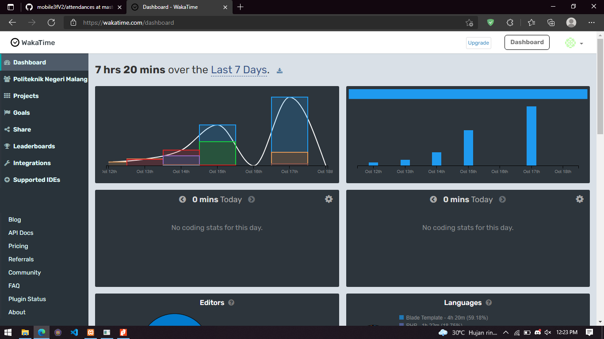

Rangkuman Pertemuan 7
==

Pada minggu ini, saya mempelajari pembuatan UI di Modul Flutter chapter 3. Konversi design ke statefull Widget agar bisa di lakukan konversi dari celcius ke suhu yang lainnya yaitu Reamur dan kelvin.
Di bagian ini sangat dibutuhkan yang namanya Variable state. karena digunakna sama seperti halnya melakukan beberapa proses di pemrograman lainnya seperti adanya penjumlahan, pengurangan dan proses yang lainnya.

Pada bagian pertama yaitu saya menambahkan controller untuk inputFormTextfield yang akan digunakan untuk input suhu celcius.
Ada shortcut yang sangat penting yang saya dapatkan dari modul, yaitu `ctrl + . ` dengan shortcut itu saya bisa mengkonversi widget yang ingin di konversi ke statefullWidget.
Sebelumnya untuk textFormField ini sudah di setting agar hanya bisa melakukan inputan berupa angka saja, dan untuk keyboard yang muncul juga hanya angka seperti di kalkukalor.
dengan menggunakan `          keyboardType: TextInputType.number,
          inputFormatters: [WhitelistingTextInputFormatter.digitsOnly],
`
Lalu menggunakna event untuk menkonversi suhu yang di inputkan dan memunculkan output dari inputan tersebut berupa konversi dari celcius ke reamur dan kelvin.

ScreenShoot waka time :

